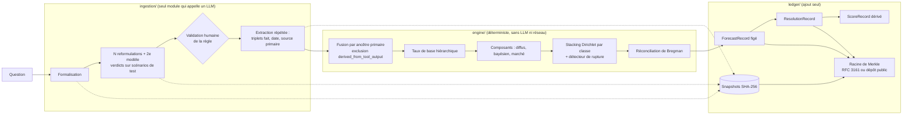

# Oracle Calibré

Outil de prévision probabiliste **auditable**. Une question en langage naturel devient un événement résoluble,
reçoit une probabilité calculée par un moteur statistique déterministe, est inscrite dans un registre chaîné
**avant** sa résolution, puis est notée par des règles de score propres.

La valeur de l'outil ne tient pas à ses explications mais à sa **calibration démontrée** : parmi les
événements annoncés à 70 %, environ 70 % doivent se réaliser. Tout est construit pour que cette
calibration puisse être mesurée honnêtement.

- Moteur de référence : Python ≥ 3.11, **bibliothèque standard uniquement** (moteur et registre).
- LLM : Claude, via le SDK officiel `anthropic`, **uniquement dans `ingestion/`**.
- Interface web : une page unique, servie par le serveur Python ou hébergée sur claude.ai.

## Démarrage rapide

```bash
pip install -r requirements.lock          # anthropic (ingestion) + pytest (tests)
export ANTHROPIC_API_KEY=...              # facultatif : sans clé, la règle se saisit à la main
python -m oracle_calibre.server --data data --port 8000
# puis http://127.0.0.1:8000
```

```bash
python -m pytest tests                    # 37 tests, dont les 12 tests d'acceptation
python -m oracle_calibre.cli verify --data data/reel
python -m oracle_calibre.cli anchor --method rfc3161 --data data/reel
python -m oracle_calibre.cli replay <forecast_id> --data data/reel
python -m oracle_calibre.cli verify-file registre_exporte.json   # registre exporté de la version hébergée
python scripts/build_web.py               # construit web/dist/index.html (version hébergée)
python scripts/sensitivity.py             # analyse de sensibilité du prior de Dirichlet
```

Deux registres coexistent : **réel** (`data/reel`) et **bac à sable** (`data/bac_a_sable`). Seul le bac à
sable accepte l'historique synthétique de démonstration.

## Architecture



| Module | Rôle | Garantie vérifiée par test |
|---|---|---|
| `oracle_calibre/ingestion/` | Formalise, reformule, décompose, extrait. Fige chaque sortie LLM en snapshot. | Garde-fou d'appel (`LLMClient.complete` refuse tout appelant hors `ingestion`) + analyse statique des imports (test 2). |
| `oracle_calibre/engine/` | Taux de base, composants, stacking, incertitudes, réconciliation. Fonction pure `run_forecast(entrées, historique, config)`. | Rejeu < 1e-9 (test 1), fonctionne réseau coupé (test 2). |
| `oracle_calibre/ledger/` | Registre chaîné, Merkle, ancrage, scores, calibration, tournoi, mode fantôme. | Altération détectée (test 9), immuabilité (test 10). |
| `oracle_calibre/app.py` | Orchestration : passe des clients LLM à l'ingestion, des données figées au moteur. N'appelle jamais un LLM lui-même. | |
| `oracle_calibre/extensions/` | Interfaces hors MVP (scores non binaires, copules, extrémisation, couche décisionnelle). Lèvent `NotInMVP`. | |
| `web/` | Interface ; `oracle_engine.js` est le portage JavaScript du moteur pour la version hébergée. | Conformance Python/JS (hash identiques, nombres à 1e-9). |

Le LLM ne produit **jamais** de probabilité, de poids ni de niveau de confiance. Les prompts
(`prompts/prompts_v1.json`, hachés dans chaque enregistrement) l'interdisent explicitement, et la
self-consistency se mesure par accord entre sorties répétées.

### Déroulé d'une prévision

1. **Formalisation** : type, définition, horizon, règle, source, échéance, politique d'ambiguïté, domaine,
   décomposition éventuelle (relations `implies`, `implied_by`, `exclusive`, `partition_member`, drapeau dur/mou),
   5 scénarios de test dont 2 limites, risque d'autoréalisation.
2. **Stabilité de la règle** : la règle retenue et N = 3 règles écrites indépendamment (sans voir la première),
   plus une par un second modèle, sont appliquées aux mêmes scénarios. `resolution_stability_score` = accord
   moyen par paires des verdicts OUI/NON/AMBIGU ; `resolution_inter_model_agreement` = accord du second modèle
   avec le verdict majoritaire. L'accord mesure la stabilité, pas la validité.
3. **Validation humaine** de la règle (modifiable). Si la règle change, seuls ses verdicts sont recalculés.
4. **Extraction** (après validation, donc sur la règle validée) : chaque document daté est lu 3 fois ;
   documents postérieurs à la prévision rejetés ; `primary_ancestor_id` = hash de (source primaire normalisée, date du fait).
5. **Moteur** puis **gel** du `ForecastRecord`.
6. **Mise à jour** = nouveau `ForecastRecord` avec `supersedes_forecast_id`. **Résolution** = `ResolutionRecord`.
   **Notation** = `ScoreRecord`, recalculé à la demande, jamais inscrit au registre.

## Méthodes statistiques (telles qu'implémentées)

**Taux de base** (`engine/base_rate.py`). Trois niveaux rétrécis l'un vers l'autre avec 10 pseudo-observations :
global (prior de Jeffreys) → type × horizon → type × horizon × domaine. Seules les résolutions inscrites
avant l'instant de prévision sont lues : l'estimation est hors échantillon par construction. Le composant
« diffus » est ce taux élargi (rétréci vers 1/2 avec 2 pseudo-observations).

**Composant bayésien hiérarchique** (`engine/components.py`). Chaque ancêtre primaire fusionné apporte un
signe (sens extrait) pondéré par sa fiabilité. Le logit vaut logit(taux de base) + Σ β_type · x_type.
Les β par type d'indice (sondage, statistique, déclaration officielle…) sont appris par régression logistique
bayésienne sur les résolutions passées, avec pooling partiel entre types (β_t ~ N(μ, τ²), μ ~ N(0,3 ; 0,2²)),
estimation MAP par Newton et covariance de Laplace. La variance totale (paramètres + extraction + biais
systématique) élargit la prévision : p = E[sigmoïde(logit + ε)] (approximation de MacKay).

**Ancrage marché.** Prix fourni par l'utilisateur, borné à [1 %, 99 %].

**Stacking** (`engine/stacking.py`). Poids maximisant Σ v_i log(Σ_k w_k f_ik) + Σ_k α_k log w_k sur les
prévisions composantes stockées (émises avant résolution, donc hors échantillon), par EM. v_i = décroissance
exponentielle (demi-vie 180 j, fenêtre 730 j) × qualité de la résolution (`resolvability_score_post`).
Pooling hiérarchique : poids globaux avec le prior prudent, puis poids par classe (type × horizon) avec un
prior centré sur les poids globaux (concentration 20). Classe vide → poids globaux ; aucun historique → prior.

**Détecteur de rupture.** Page-Hinkley sur la perte relative de chaque composant face au composant diffus.
Si un composant rompt, on réestime les poids avant et après la rupture. Son poids devient le minimum du
poids complet et du poids après rupture ; chaque autre source informée est plafonnée à son poids d'avant la
rupture ; **toute la masse libérée va au composant diffus**, jamais aux autres sources (une rupture peut
signaler un changement de régime qui touche aussi les sources corrélées).

**Résolubilité** (continue, jamais bloquante). Moyenne géométrique de : clarté de la règle (stabilité, et
accord inter-modèles s'il existe), nature de la source, fréquence des résolutions non annulées dans la classe.

**Un seul rétrécissement.** Les poids informatifs appris pour la classe sont multipliés par la résolubilité ;
la masse retirée va au composant diffus ; p_brut = Σ w_k p_k est calculé une fois. `w_displayed` est affiché,
jamais réappliqué (test 7).

**Biais systématique** (`engine/uncertainty.py`). Si le logit vrai = logit prévu + ε, ε ~ N(0, s²), alors
Var(y − p) ≈ p(1−p) + (p(1−p))² s². Estimateur des moments par domaine sur les résolutions journalisées,
rétréci vers le plancher (0,15), jamais en dessous, multiplié par (1 + 1/nombre d'ancêtres primaires distincts).

**Incertitude d'extraction.** Taux d'erreur par type (date, entité, relation, causalité) depuis un échantillon
annoté, avec pooling partiel et IC à 95 % (Bêta). Sans annotation : prior Bêta(1, 9), intervalle large.
Fiabilité d'un indice = cohérence entre extractions × (1 − 2 e_relation) × (1 − e_entité)(1 − e_date)(1 − e_causalité).

**Réconciliation** (`engine/reconcile.py`). Contraintes dures : projection sur l'enveloppe convexe des mondes
logiquement possibles, en minimisant la divergence de Bregman de la règle de score (KL binaire pour le
log-score). Résolution par Frank-Wolfe par paires. D'après Predd et al. (2009) la projection améliore le score
dans tout état du monde cohérent, ce que vérifie un test. Contraintes molles : pénalité quadratique.

**Incertitude épistémique.** Bêta ajustée par les moments sur le mélange des composants et de leurs
variances. Elle décrit l'incertitude sur p ; le score s'applique à p.

## Hyperparamètres préenregistrés

Configuration en vigueur : `config/stat_config_v2.json` (la v1 est conservée telle quelle). Son hash est inscrit dans chaque `ForecastRecord`
(`statistical_config_version`, `statistical_config_hash`). **Règle : une version déjà utilisée ne se modifie
jamais** ; tout changement crée un nouveau fichier (`stat_config_v2.json`…). Chaque enregistrement portant
sa version, les évaluations peuvent être séparées par version.

| Paramètre | Valeur | Rôle |
|---|---|---|
| `dirichlet.alpha` | diffus 4 ; bayésien 0,1 ; marché 0,1 | Prior « souple » (v2) : w ≈ 0,04 sans historique |
| `dirichlet.class_concentration` | 20 | Rappel des poids de classe vers les poids globaux |
| `stacking.half_life_days` / `window_days` | 180 / 730 | Décroissance et fenêtre glissante |
| `stacking.changepoint` | δ = 0,1 ; seuil 10 | Page-Hinkley (calibration ci-dessous) |
| `base_rate.level_pseudo_obs` | 10 | Rétrécissement entre niveaux de classe |
| `bayes.mu0`, `mu0_sd`, `tau` | 0,3 ; 0,2 ; 0,25 | Prior sur l'effet d'un indice (logit) |
| `systematic_bias.floor_logit_var` | 0,15 | Plancher de la variance de biais commun |
| `extraction.prior_error_rate` | Bêta(1, 9) | Taux d'erreur d'extraction sans annotation |
| `reconciliation.scoring_rule` | log | Divergence de Bregman associée (KL) |
| `ingestion.n_reformulations` / `n_extractions` | 3 / 3 | Mesures de stabilité et de self-consistency |
| `evaluation.bootstrap_reps`, `seed`, `mcs_alpha` | 2000 ; 20261004 ; 0,10 | Tests appariés et MCS |

**Calibration du détecteur de rupture**, faite le 2026-10-04 avant tout usage réel, sur historiques
synthétiques : 1 % de fausses alarmes sur 200 historiques sains de 600 résolutions, 100 % de détection
quand 60 résolutions sur 260 sont dégradées.

**Sensibilité du prior de Dirichlet** (`docs/sensibilite_dirichlet.md`, données synthétiques, moyenne sur
10 historiques, w = part du poids donnée aux composants informés) :

| Réglage | α diffus / informés | N = 0 | 25 | 50 | 100 | 200 | 400 |
|---|---|---|---|---|---|---|---|
| Marché informatif, prudent (retenu) | 8 / 0,25 | 0,05 | 0,16 | 0,31 | 0,55 | 0,70 | 0,80 |
| Marché informatif, très prudent | 16 / 0,25 | 0,03 | 0,06 | 0,13 | 0,36 | 0,60 | 0,75 |
| Marché informatif, souple | 4 / 0,5 | 0,18 | 0,41 | 0,52 | 0,68 | 0,77 | 0,84 |
| Marché = bruit, prudent (retenu) | 8 / 0,25 | 0,05 | 0,06 | 0,06 | 0,06 | 0,06 | 0,06 |

Lecture : avec le réglage retenu, une source fiable obtient la moitié du poids après une centaine de
résolutions ; une source sans valeur reste à 6 %. Le réglage « souple » apprend plus vite mais part de
w = 0,18 sans aucun historique, ce qui s'écarte de l'exigence « sans historique, w → 0 ».

### Journal des décisions sur la configuration

| Version | Date | Changement | Raison |
|---|---|---|---|
| 1.0.0 | 2026-10-04 | Configuration initiale ; seuil du détecteur de rupture calibré sur données synthétiques | Préenregistrement |
| 2.0.0 | 2026-10-04 | Prior de Dirichlet diffus 8 → 4, informés 0,25 → 0,1 | Décision de l'utilisateur après l'analyse de sensibilité, avant toute prévision réelle (registre réel vide). La variante 4 / 0,5 de la grille a été écartée : elle part de w = 0,18 sans historique, contraire au test 4. |

## Évaluation

- **Scores** (pertes, plus bas = meilleur) : Brier et log par prévision, sur p brut et p réconcilié, et sur
  la prévision gelée à t0 (`score_frozen_t0`).
- **Décomposition de Murphy** et **courbe de calibration** par tranches, avec intervalles de Jeffreys à 95 %.
- **Comparaison au taux de base** : différence appariée question par question, par classe, avec IC par
  bootstrap circulaire par blocs temporels et test de Diebold-Mariano (variance de Newey-West). Jamais de
  chevauchement d'intervalles, jamais de statut PASS/FAIL.
- **Valeur des mises à jour** : score de la dernière prévision moins score de la prévision gelée à t0.
- **Tournoi** : taux de base seul, moyenne simple, bayésien seul, stack brut, stack réconcilié (officiel),
  marché seul quand il existe, tous recalculés depuis les composants stockés. Désignation du moteur officiel
  par **Model Confidence Set** (Hansen, Lunde et Nason 2011, statistique T_max). Si le stack officiel sort du
  MCS, l'interface le dit.
- **Mode fantôme** : import JSON de l'API Manifold (`/v0/search-markets`, `/v0/markets`) ou Metaculus
  (`/api/posts/`). Les questions ouvertes sont prévues **sans** la prévision communautaire (stockée à part,
  au champ `shadow`) ; les questions résolues du même import clôturent les prévisions fantômes. Comparaison
  : différence appariée de log-score outil − communauté, avec IC.

## Registre et ancrage

Chaque entrée est `{seq, record_type, record, entry_hash}` avec `record.hash_previous` = hash de l'entrée
précédente et `entry_hash` = SHA-256 du JSON canonique (clés triées, format numérique identique en Python et
en JavaScript). Il n'existe aucune méthode de modification ou de suppression. La racine de Merkle (RFC 6962)
couvre les ForecastRecords, les ResolutionRecords, les lots de référence et les hash de tous les snapshots.

Ancrage externe : `cli anchor --method rfc3161` construit la requête DER RFC 3161 (sans dépendance), l'envoie
à une autorité d'horodatage (freetsa.org par défaut) et stocke le jeton, vérifiable avec
`openssl ts -verify -digest <racine> -in jeton.tsr -CAfile cacert.pem -untrusted tsa.crt`. Variante :
`--method public_repo` ajoute la racine à `anchors/merkle_roots.jsonl`, à pousser dans un dépôt public.

## Reproductibilité

Chaque `ForecastRecord` porte : fournisseur et modèle LLM, hash des prompts, hash du lot de snapshots LLM,
hash de la récupération, hash des entrées du moteur, commit du code, hash du fichier de dépendances
verrouillées, version et hash de la configuration. Le rejeu (`cli replay`, ou le bouton de l'interface)
reconstruit l'ingestion à partir des snapshots via un `ReplayClient` **sans aucun appel LLM**, relit le
registre tel qu'il était avant la prévision, et compare : l'écart doit rester sous 1e-9 (il vaut 0 en pratique).

`temperature` et `seed_if_supported` valent `null` : les modèles Claude actuels refusent ce paramètre et
n'exposent pas de graine. La variabilité entre reformulations vient de l'échantillonnage par défaut ; c'est
précisément ce que la mesure de stabilité exploite, et les snapshots rendent le tout rejouable.

## Version hébergée sur claude.ai

La page hébergée ne peut charger que des scripts ; elle ne peut pas exécuter Python de façon fiable
(WebAssembly et téléchargements bloqués). Elle exécute donc `web/oracle_engine.js`, portage fonction par
fonction du moteur Python, dont la conformité est testée : mêmes entrées, **mêmes hash à l'octet près et
mêmes nombres à 1e-9 près** (`tests/test_js_conformance.py`, avec contrôle par mutation). Un registre écrit
par la version hébergée se vérifie avec le vérificateur Python (`cli verify-file`).

| | Serveur local (Python) | Version hébergée |
|---|---|---|
| Moteur | Python (référence) | JavaScript conforme |
| LLM | `claude-opus-5-5` + `claude-haiku-4-5` (second modèle) | Claude du compte du visiteur (niveaux « default » et « quick ») |
| Registre | fichier JSONL + snapshots | base de documents de l'artefact |
| Ancrage externe | RFC 3161 ou dépôt public | racine calculée, à publier hors de la page |
| Mode fantôme | `cli import-shadow` ou collage JSON | collage JSON uniquement |

## Tests

| Test d'acceptation | Fichier : fonction |
|---|---|
| 1. Rejeu < 1e-9 depuis snapshots, nouvelle instance sans LLM | `tests/test_acceptance.py::test_01_replay_from_snapshots_matches` |
| 2. Aucun appel LLM hors `ingestion/` | `test_02_no_llm_call_outside_ingestion` (statique, garde-fou, réseau coupé) |
| 3. Dupliquer 10 fois une information primaire ne déplace pas p | `test_03_…`, `test_03b_duplicates_through_ingestion` |
| 4. Plus d'historique validé ne réduit pas w ; sans historique w → 0 | `test_04_…` |
| 5. Des résolutions de mauvaise qualité n'augmentent pas w | `test_05_…` |
| 6. Un composant dégradé perd du poids au profit du diffus | `test_06_…` (avec et sans marché) |
| 7. Recalcul de p depuis composants et poids stockés | `test_07_…` |
| 8. Violation A ⇒ B injectée, corrigée par projection | `test_08_…`, `test_08b_soft_constraint_only_penalised` |
| 9. Altération ⇒ hash suivants et racine de Merkle invalides | `test_09_…` (trois niveaux d'attaque) |
| 10. Un ForecastRecord ne peut être que remplacé | `test_10_…` |
| 11. Refus si un champ de résolution obligatoire manque | `test_11_…` (paramétré sur les 6 champs) |
| 12. `derived_from_tool_output` jamais agrégé | `test_12_…` (moteur et ingestion) |

Les propriétés 4, 5 et 6 sont aussi vérifiées sur 10 graines (`tests/test_units.py::test_properties_hold_across_seeds`)
pour qu'elles ne passent pas grâce à une graine favorable. `tests/e2e/` contient deux parcours navigateur
(Playwright) : serveur Python, et version hébergée avec claude.ai simulé (`mock_claude.js`).

## Choix faits là où la spécification laissait un doute

1. **Définition de w.** La spécification dit « w = poids du composant base_rate », mais trois autres exigences
   (faible résolubilité ⇒ w → 0 ; sans historique ⇒ w → 0 ; plus d'historique validé ne réduit pas w) ne sont
   cohérentes que si w est la part donnée aux composants **informés**. Retenu : **w = 1 − poids du composant
   diffus**. Le poids du diffus reste visible dans `stacking_weights.base_rate`.
2. **Effet de la résolubilité** : elle multiplie les poids informatifs appris ; la masse retirée va au diffus.
3. **Rupture** : la masse perdue par le composant en rupture va au diffus, et les autres sources sont
   plafonnées à leur poids d'avant la rupture (voir plus haut), même quand l'une d'elles serait meilleure sur
   la période récente. C'est plus prudent que l'optimum du score.
4. **Collecte des sources** : l'utilisateur colle des documents datés. Aucune recherche web automatique,
   faute de corpus figé à la date de la question ; c'est le moyen le plus simple de garantir le filtre de date.
5. **Sens des indices** : le LLM classe chaque fait comme favorable, défavorable ou neutre. C'est une
   classification, pas une probabilité ; son effet chiffré est appris sur les résolutions.
6. **Classe de référence** = type × horizon (pour w) et type × horizon × domaine (pour le taux de base).
7. **Sous-questions** : proposées et enregistrées dans `decomposition` ; chacune se prévoit séparément puis se
   lie à la question mère, ce qui active la réconciliation.

## Limites connues

- **Chocs structurels inédits** : couverts seulement par l'élargissement de la distribution (biais systématique,
  détecteur de rupture), pas par un modèle.
- **Validation lente** : la seule validation non contaminée est prospective. Sans historique résolu, w reste
  proche de 0 et l'outil annonce essentiellement le taux de base (près de 50 % au démarrage). C'est voulu, mais
  il faut des dizaines à centaines de résolutions avant que les modèles pèsent (voir la table de sensibilité).
- **Périmètre du mode fantôme** : les questions de Manifold et Metaculus sont sélectionnées par ces plateformes ;
  un bon résultat ne vaut que pour leurs classes de questions. L'adaptateur Metaculus n'a pas pu être testé
  contre l'API réelle (accès réseau indisponible pendant le développement).
- **Fragilité de la formalisation sans validation humaine** : l'accord entre reformulations et entre modèles
  mesure la stabilité de la règle, pas sa justesse. Une règle non validée garde ce statut partout.
- **Publication autoréalisatrice** : signalée par le LLM et affichée, jamais modélisée.
- **Bruit de l'estimateur de biais systématique** : il est rétréci vers son plancher, mais reste bruité tant
  que les résolutions du domaine sont peu nombreuses.
- **Version hébergée** : le registre est en ajout seul par construction du code, mais la base de l'artefact
  n'interdit pas techniquement une réécriture ; une altération est **détectée** (chaîne et Merkle), pas empêchée.
  L'identité exacte du modèle Claude utilisé n'y est pas exposée par la plateforme.
- **Ancrage RFC 3161** : la requête DER est testée hors ligne ; l'appel à une autorité réelle n'a pas pu être
  exercé depuis l'environnement de développement.
